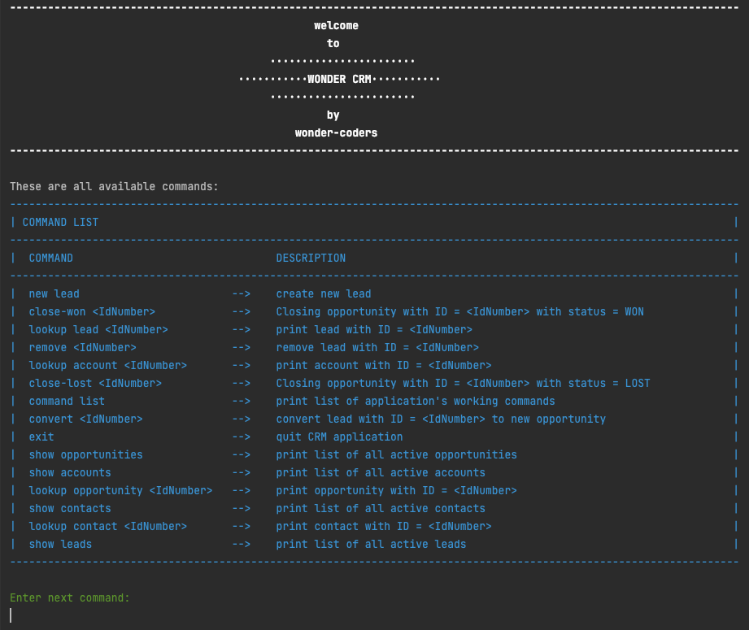
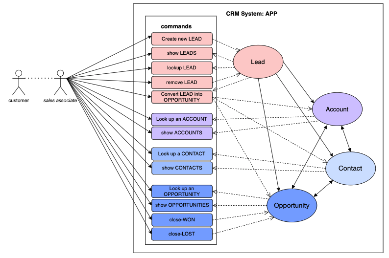
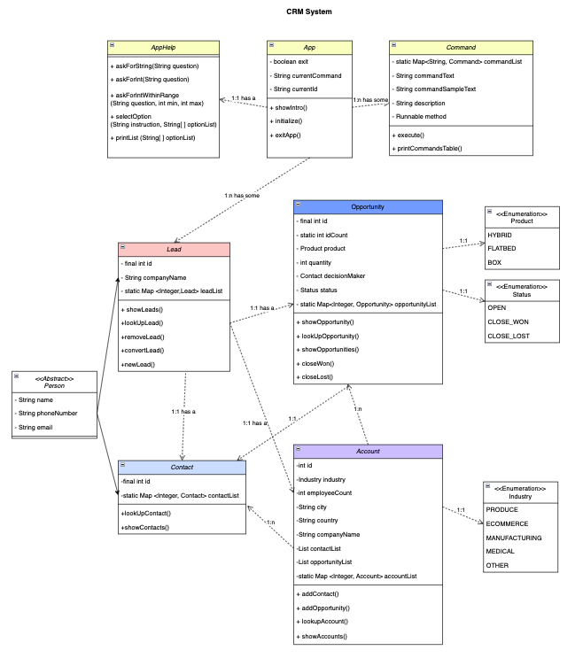

# WonderCoders Customer Relationship Management App

## How to use

This tool will make tracking prospective and existing customers through the sales process much easier for the companies.The App is ready to be used, just run the main file and the App will start working. It will first show the user a list of all the commands accepted and the user will just have to type whatever they want to do. The App will constantly ask the user for information and it will complete the request with the information given. Easy and simple!

### Image from the app:

### Use case diagram:

## Technical aspects

The game is entirely based on the App class and its initialize() method. This method initializes the application, sets a list of commands and asks the user for next command to execute. Every method nedded in the App is inside this list of commands.  

The methods contained in AppHelp class ask and receive information from the user or show information to the user.

Command class sets a series of attributes for each command, one of them being a Runnable. When a command is executed from App the runnable calls the corresponding methods in the needed class (lead / opportunity / account / contact).

Opportunity class contains the methods to show a list of opportunities, lookup one opportunity and change the status to close won or closed lost

Status enumeration is a list of the different status a opportunity can have.

Product enumeration sets the different types of products.

The Account class contains methods to create an account, show an account or a list of accounts and look up an account by its Id.

Lead and Contact classes are Person's extended classes. The only differences between them are Lead class contains a method to create new leads and a method to convert leads into opportunities, contacts and accounts.  

TextColor class is a library of different colors for the log to be printed out.

### Class diagram:

*This CRM was developed using java.*

A project by Núria Mafé, Olatz Izagirre, Paula Kamisato and Beatriz Pérez.

Link to our trello board : https://trello.com/b/7imiO5WD/homework-2-crm

